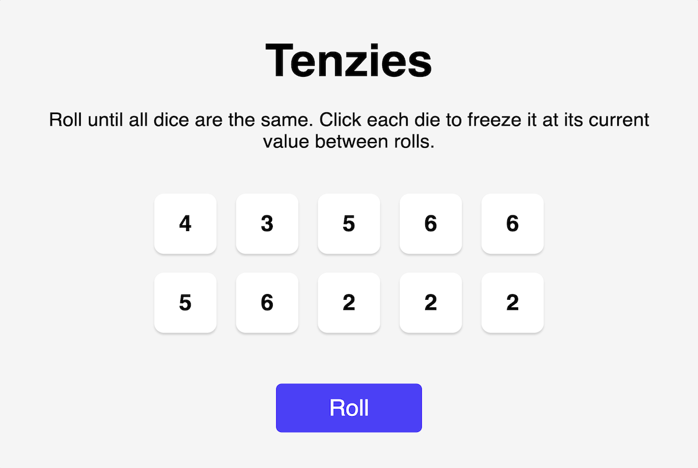

<div id="top"></div>
<!--
*** Thanks for checking out the Best-README-Template. If you have a suggestion
*** that would make this better, please fork the repo and create a pull request
*** or simply open an issue with the tag "enhancement".
*** Don't forget to give the project a star!
*** Thanks again! Now go create something AMAZING! :D
-->


<!-- PROJECT SHIELDS -->
<!--
*** I'm using markdown "reference style" links for readability.
*** Reference links are enclosed in brackets [ ] instead of parentheses ( ).
*** See the bottom of this document for the declaration of the reference variables
*** for contributors-url, forks-url, etc. This is an optional, concise syntax you may use.
*** https://www.markdownguide.org/basic-syntax/#reference-style-links
-->
[![Contributors][contributors-shield]][contributors-url]
[![Forks][forks-shield]][forks-url]
[![Stargazers][stars-shield]][stars-url]
[![Issues][issues-shield]][issues-url]
[![MIT License][license-shield]][license-url]
[![LinkedIn][linkedin-shield]][linkedin-url]


<!-- PROJECT LOGO -->
<br />
<div align="center">
  <a href="https://s4muele.github.io/Tenzies/">
    
  </a>

<h3 align="center">Tenzies</h3>

  <p align="center">
    A web based dice game, made with React.
    <br />
    <a href="https://github.com/S4muele/Tenzies"><strong>Explore the docs »</strong></a>
    <br />
    <br />
    <a href="https://s4muele.github.io/Tenzies/" target="_blank">View Demo</a>
    ·
    <a href="https://github.com/S4muele/Tenzies/issues" target="_blank">Report Bug</a>
    ·
    <a href="https://github.com/S4muele/Tenzies/issues" target="_blank">Request Feature</a>
  </p>
</div>


<!-- TABLE OF CONTENTS -->
<details>
  <summary>Table of Contents</summary>
  <ol>
    <li>
      <a href="#about-the-project">About The Project</a>
      <ul>
        <li><a href="#built-with">Built With</a></li>
      </ul>
    </li>
    <li>
      <a href="#getting-started">Getting Started</a>
      <ul>
        <li><a href="#prerequisites">Prerequisites</a></li>
        <li><a href="#installation">Installation</a></li>
      </ul>
    </li>
    <li><a href="#usage">Usage</a></li>
    <li><a href="#contributing">Contributing</a></li>
    <li><a href="#license">License</a></li>
    <li><a href="#contact">Contact</a></li>
    <li><a href="#acknowledgments">Acknowledgments</a></li>
  </ol>
</details>


<!-- ABOUT THE PROJECT -->
## About The Project

<div align="center">
  <a href="https://s4muele.github.io/Tenzies/" target="_blank" align="center">
    
  </a>
  
</div>

<br>
A web based dice game inspired by the board game <a href="https://boardgamegeek.com/boardgame/113819/tenzi">Tenzi</a>

<p align="right">(<a href="#top">back to top</a>)</p>


### Built With

* [React.js](https://reactjs.org/)

<p align="right">(<a href="#top">back to top</a>)</p>


<!-- GETTING STARTED -->
## Getting Started

To get a local copy up and running, you might follow these example steps.

### Prerequisites

This project was bootstrapped with [Create React App](https://create-react-app.dev/docs/getting-started/).
<br>
To create one, first make sure you have the latest version of node.js and npm (or yarn) installed to your machine, then run the appropriate command for your chosen package manager: 
* npm
  ```sh
    npx create-react-app my-app
  ```
* yarn
  ```
    yarn create react-app my-app
  ```

### Installation

1. Clone this repository to your local machine:
   ```sh
   git clone https://github.com/S4muele/Tenzies.git
   ```
2. Copy the Tenzies files to your newely created React App boilerplate.

3. You'll need [nanoid](https://github.com/ai/nanoid#readme) and [react-confetti](https://www.npmjs.com/package/react-confetti) installed as dependencies to your project:
   ```sh
   npm install --save nanoid
   ```
   
   ```sh
   npm install react-confetti
   ```
4. Finally, navigate to the application folder and run it:
   ```
    npm start
   ```
<p align="right">(<a href="#top">back to top</a>)</p>


<!-- USAGE EXAMPLES -->
## Usage

Click on a die to hold its current value, then click on the "Roll" button to roll all unheld dices. You win the game when all held dices have the same value.

<p align="right">(<a href="#top">back to top</a>)</p>

<!-- CONTRIBUTING -->
## Contributing

Contributions are what make the open source community such an amazing place to learn, inspire, and create. Any contributions you make are **greatly appreciated**.

If you have a suggestion that would make this better, please fork the repo and create a pull request. You can also simply open an issue with the tag "enhancement".
Don't forget to give the project a star! Thanks again!

1. Fork the Project
2. Create your Feature Branch (`git checkout -b feature/AmazingFeature`)
3. Commit your Changes (`git commit -m 'Add some AmazingFeature'`)
4. Push to the Branch (`git push origin feature/AmazingFeature`)
5. Open a Pull Request

<p align="right">(<a href="#top">back to top</a>)</p>


<!-- LICENSE -->
## License

Distributed under the MIT License. See `LICENSE.txt` for more information.

<p align="right">(<a href="#top">back to top</a>)</p>


<!-- CONTACT -->
## Contact

[S4muele](https://www.linkedin.com/in/samuele-simeone-b27173216/) - [@anthony_sime](https://twitter.com/anthony_sime)

<p align="right">(<a href="#top">back to top</a>)</p>

<!-- ACKNOWLEDGMENTS -->
## Acknowledgments

* Thanks to [Scrimba](https://scrimba.com) for the project idea. Make sure you check their amazing coding tutorials and subscribe to their *Frontend Developer Career Path* course if you're interested in learning to code in a fun and interactive way!

<p align="right">(<a href="#top">back to top</a>)</p>


<!-- MARKDOWN LINKS & IMAGES -->
<!-- https://www.markdownguide.org/basic-syntax/#reference-style-links -->
[contributors-shield]: https://img.shields.io/github/contributors/S4muele/tenzies.svg?style=for-the-badge
[contributors-url]: https://github.com/S4muele/tenzies/graphs/contributors
[forks-shield]: https://img.shields.io/github/forks/S4muele/tenzies.svg?style=for-the-badge
[forks-url]: https://github.com/S4muele/tenzies/network/members
[stars-shield]: https://img.shields.io/github/stars/S4muele/tenzies.svg?style=for-the-badge
[stars-url]: https://github.com/S4muele/tenzies/stargazers
[issues-shield]: https://img.shields.io/github/issues/S4muele/tenzies.svg?style=for-the-badge
[issues-url]: https://github.com/S4muele/tenzies/issues
[license-shield]: https://img.shields.io/github/license/S4muele/tenzies.svg?style=for-the-badge
[license-url]: https://github.com/S4muele/tenzies/blob/master/LICENSE.txt
[linkedin-shield]: https://img.shields.io/badge/-LinkedIn-black.svg?style=for-the-badge&logo=linkedin&colorB=555
[linkedin-url]: https://www.linkedin.com/in/samuele-simeone-b27173216/
[product-screenshot]: images/tenzies_thumb.png
